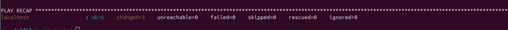

This repository installs the following basic setup on your local machine:
- The user credentials in github
- The ZSH Shell and the Oh My Zsh configuration from the corresponding repository.
- TMUX to be able to split the terminal and use several sessions in one terminal.
- The Tmux Plugin Manager (TPM) to customize TMUX.

## PREREQUISITES
To automatically install everything mentioned before we have to have in our local PC:
- Ansible. You can install it using:
```console
python3 -m pip install --user ansible
```
- You have to clone this repository in your HOME directory

## HOW TO INSTALL 
Enter the directory where you clone this repository and execute the following command with ansible
```console
ansible-playbook ansible.yml --ask-become-pass
```
If everything goes correctly you should see


## FUTURE IMPROVEMENTS
- Using Keepass to obtain the SSH key to configure the indetification in Github
- Configure the LazyVIM editor to work with

## REFERENCES
- VIDEOS
    - [~/.dotfiles 101: A Zero to Configuration Hero Blueprint](https://www.youtube.com/watch?v=WpQ5YiM7rD4)
    - [~/.dotfiles in 100 Seconds](https://www.youtube.com/watch?v=r_MpUP6aKiQ)
    - [BEAUTIFUL Terminal Themes! OhMyZsh Guide | powerlevel10k Theme + Guide](https://www.youtube.com/watch?v=DmpMgTL6R9A)
    - [Ansible Explained in 4 Minutes | Ansible Tutorial for Beginners (2025)](https://www.youtube.com/watch?v=SuUnLqWpnEM&t=46s)
- ARTICLES
    - [How to Build Your Own Linux Dotfiles Manager from Scratch](https://www.freecodecamp.org/news/build-your-own-dotfiles-manager-from-scratch/)
    - [¿Qué son los Dotfiles? Guía completa de usos y beneficios](https://www.datacamp.com/es/tutorial/dotfiles?dc_referrer=https%3A%2F%2Fwww.google.com%2F)
    - [Ansible for dotfiles: the introduction I wish I've had](https://phelipetls.github.io/posts/introduction-to-ansible/#installing-ansible)

## ACKNOWLEDGMENTS
Thanks to @quiqueporta to show this amazing manner to initialize anywhere the configuration that I want to work!